# Registro Panela

Aplicación web (Flutter + Firebase) para el seguimiento del proceso de producción de panela: desde la entrega del producto por parte de las moliendas, pasando por el pesaje y la recolección, hasta la liquidación final con el productor. Incluye control de inventario de gaveras/canastillas y trazabilidad por QR de las entregas de cada molienda.

📹 **Demo en video:** [youtube.com/shorts/enNVjhjFtxQ](https://youtube.com/shorts/enNVjhjFtxQ?si=m5BRrr1kw34nmO-N)

> Este proyecto fue originalmente un monorepo (Melos) con una app mobile, una app web y un paquete `core` compartido. La app mobile fue retirada y todo se colapsó en este proyecto Flutter estándar: un solo `pubspec.yaml`, un solo `lib/`, un solo `test/`. Hoy solo existe (y se mantiene) la versión web.

---

## Tabla de contenidos

- [Stack técnico](#stack-técnico)
- [Flujo de negocio](#flujo-de-negocio)
- [Arquitectura](#arquitectura)
- [Estructura del proyecto](#estructura-del-proyecto)
- [Puesta en marcha](#puesta-en-marcha)
- [Comandos comunes](#comandos-comunes)
- [Testing](#testing)
- [Firestore](#firestore)
- [Roles y permisos](#roles-y-permisos)
- [Cloud Functions](#cloud-functions)
- [Despliegue](#despliegue)
- [Pantallas principales](#pantallas-principales)

---

## Stack técnico

| Área | Tecnología |
|---|---|
| Framework | Flutter (web) |
| Backend | Firebase (Auth, Firestore, Storage, Cloud Functions) |
| Estado | Riverpod (`flutter_riverpod` + `riverpod_annotation`, con codegen) |
| Routing | `go_router` con redirección por rol (`authRedirect`) |
| Modelos | `freezed` + `json_serializable` |
| Formularios | `flutter_form_builder` + `form_builder_validators` |
| PDF | `pdf` + `printing` |
| QR | `qr_flutter` (generación) + `zxing_lib` (lectura vía WebRTC propio) |
| Funciones serverless | Firebase Cloud Functions (TypeScript) |
| Tests | `flutter_test`, `mocktail` — 179 tests (unit + widget) |

## Flujo de negocio

La producción de una molienda se registra como un **proyecto** que avanza por etapas (stages):

1. **Stage 1 — Entrega**: registro inicial del lote entregado por la molienda (gaveras, canastillas, preservativos, cal, foto). Al guardar, si el lote está asociado a una molienda, se genera automáticamente una **Entrega** con un código QR para trazabilidad.
2. **Stage 2 — Cargue**: datos del cargue de canastillas (peso de referencia, cantidad, calidad).
3. **Stage 3 — Pesaje**: pesaje real de cada canastilla, con calidad y foto de soporte por unidad.
4. **Stage 4 — Recolección**: registro de gaveras y canastillas devueltas, más devolución de preservativos/cal.
5. **Stage 5 — Liquidación**: incluye:
   - **Missing weight**: pagos/abonos pendientes.
   - **Records (5.2)**: registros individuales de panela (peso, calidad, unidades).
   - **Summary**: resumen agregado por día/calidad.
   - **Invoice**: factura final por líneas de calidad (kg, bultos, precio, subtotal).

Junto al flujo principal:

- **Inventario**: control de unidades disponibles de gaveras (por peso/tipo) y canastillas (por tamaño). Se descuenta al crear un Stage 1 y se ajusta automáticamente (incrementa/decrementa) al editarlo.
- **Moliendas**: catálogo de moliendas (nombre, teléfono) y sus entregas históricas, cada una con un QR único (`entrega.qrToken`) que permite escanear el QR físico y llegar directo al detalle del lote.
- **Administración**: gestión de usuarios y sus roles/contraseñas, restringida a usuarios con custom claim `admin` verificado server-side en Cloud Functions.

## Arquitectura

Cada feature de negocio vive en `lib/features/<feature_name>/` siguiendo clean architecture:

```
lib/features/<feature_name>/
├── data/
│   ├── datasources/       # Consultas a Firestore
│   ├── models/             # Modelos JSON serializables (toJson/fromJson)
│   └── repositories_impl/
├── domain/
│   ├── entities/           # Clases inmutables con Freezed
│   ├── repositories/       # Interfaces abstractas
│   └── usecases/           # Casos de uso de responsabilidad única
└── presentation/
    ├── pages/               # Pantallas mobile_*.dart / web_*.dart
    └── providers/           # Providers de Riverpod (@riverpod)
```

Algunas features solo de UI (`project_selector`, `splash`, `stage_selector`, `shared`) no tienen `data`/`domain` porque no manejan persistencia propia.

### UI responsiva

Cada ruta tiene **dos variantes de layout**, servidas por `AdaptiveLayout` (breakpoint configurable, 600px por defecto):

| Variante | Prefijo de archivo | Objetivo |
|---|---|---|
| Pantalla chica | `mobile_*.dart` | teléfonos / navegador angosto |
| Pantalla grande | `web_*.dart` | escritorio / tablet |

```dart
AdaptiveLayout(
  mobile: MobileAlgunaPage(),
  web: WebAlgunaPage(),
)
```

Las pantallas grandes usan `WebLayout` (un `NavigationRail` lateral, en `lib/features/shared/web_layout.dart`). Al agregar o modificar una feature, **siempre se actualizan ambas variantes**.

### Estado

Riverpod con generación de código (`@riverpod`). Los providers viven en `lib/features/<feature>/presentation/providers/`; los archivos generados terminan en `.g.dart` y nunca se editan a mano.

El estado de autenticación vive en el notifier `Auth` (`lib/features/auth/presentation/providers/auth_provider.dart`), mantenido vivo con `@Riverpod(keepAlive: true)`. `go_router` usa `GoRouterNotifier` + `authRedirect` para proteger rutas según sesión y rol.

### Modelos de datos

Las entidades usan `freezed` + `json_serializable`. Cada entidad tiene tres archivos: `entity.dart` (fuente), `entity.freezed.dart` (copyWith/equality generados) y `entity.g.dart` (fromJson/toJson generados). Tras modificar cualquier entidad hay que correr `build_runner`.

## Estructura del proyecto

```
registro_panela/
├── pubspec.yaml
├── lib/
│   ├── main.dart                # Init de Firebase, ProviderScope, MaterialApp.router
│   ├── firebase_options.dart
│   ├── core/
│   │   ├── router/               # app_router.dart, routes.dart, authRedirect, GoRouterNotifier
│   │   ├── services/             # compresión de imágenes, snackbars, image picker
│   │   ├── storage/               # Firebase Storage (subida de fotos)
│   │   └── theme/                 # colores, tipografía, spacing
│   ├── features/                 # Un folder por feature (data/domain/presentation)
│   │   ├── admin/
│   │   ├── auth/
│   │   ├── inventory/
│   │   ├── molienda/
│   │   ├── pdf/
│   │   ├── project_selector/
│   │   ├── shared/                # AdaptiveLayout, WebLayout, dialogs compartidos
│   │   ├── splash/
│   │   ├── stage1_delivery/
│   │   ├── stage2_load/
│   │   ├── stage3_weigh/
│   │   ├── stage4_recollection/
│   │   ├── stage5/                 # Invoice
│   │   ├── stage5_1_missing_weight/
│   │   ├── stage5_2_records/
│   │   ├── stage5_3_summary/
│   │   └── stage_selector/
│   └── shared/                    # Widgets/helpers realmente transversales (no ligados a una feature)
├── test/
│   ├── unit/
│   └── widget/
├── web/                            # index.html, manifest, iconos (target Flutter web)
└── functions/                      # Cloud Functions en TypeScript
```

## Puesta en marcha

### Requisitos

- Flutter SDK (canal estable, Dart `^3.8.1`)
- Un proyecto Firebase configurado (`lib/firebase_options.dart` ya apunta a `registro-panelera`; para un proyecto propio, regenerar con `flutterfire configure`)
- Node.js (solo si vas a tocar `functions/`)

### Instalación

```bash
flutter pub get
```

### Ejecutar la app

```bash
flutter run -d chrome
```

### Generación de código (Freezed, Riverpod, json_serializable)

```bash
dart run build_runner build --delete-conflicting-outputs

# Modo watch
dart run build_runner watch --delete-conflicting-outputs
```

## Comandos comunes

| Comando | Qué hace |
|---|---|
| `flutter analyze` | Lint estático |
| `flutter test` | Corre toda la suite (unit + widget) |
| `flutter build web` | Build de producción para hosting |
| `firebase deploy --only hosting` | Despliega `build/web` |
| `firebase deploy --only functions` | Despliega las Cloud Functions |

## Testing

```bash
flutter test
```

179 tests en verde (unit + widget), organizados como:

```
test/
├── unit/
│   ├── feature/<feature>/data/...         # modelos y repositorios (mocktail)
│   ├── feature/<feature>/repositories/... # casos de uso
│   ├── providers/                          # providers de resumen/agregación
│   ├── router/                             # authRedirect
│   └── services/
└── widget/                                 # páginas y formularios (mobile + web)
```

## Firestore

| Colección | Contenido |
|---|---|
| `stage1` | Registro de entrega (gaveras, canastillas, preservativos) |
| `stage2` | Datos de cargue |
| `stage3` | Pesaje |
| `stage4` | Recolección |
| `stage51` | Pagos/abonos (Stage 5.1 — missing weight) |
| `stage52` | Registros individuales de panela (Stage 5.2 — records); la factura y el resumen de Stage 5 se calculan a partir de estos registros, no tienen colección propia |
| `users` | Perfiles de usuario con campo `role` |
| `inventory` | Inventario de gaveras y canastillas |
| `moliendas` | Moliendas registradas |
| `moliendas/{id}/entregas` | Subcolección de entregas por molienda, cada una con `qrToken` |

> La búsqueda de una entrega por QR usa `collectionGroup('entregas').where('qrToken', ...)`, lo que requiere un índice **Collection Group** (`entregas`, campo `qrToken` ASC) creado manualmente en Firebase Console → Firestore → Indexes. Sin el índice, la consulta falla en silencio (`failed-precondition`) y retorna vacío.

## Roles y permisos

Definidos en `lib/features/auth/domain/enums/user_role.dart`: `admin`, `stage1`, `stage2`, `stage3`, `stage4`, `stage5`. El rol se guarda en el documento del usuario en Firestore y también como **custom claim** de Firebase Auth, verificado del lado del servidor en las Cloud Functions (`functions/src/index.ts`) para las operaciones administrativas (cambiar contraseñas, asignar rol admin).

## Cloud Functions

`functions/src/index.ts` expone (TypeScript, `firebase-functions` v2):

- `adminUpdateUserPassword` — cambia la contraseña de un usuario; requiere claim `role: admin`.
- `setUserAsAdmin` — asigna el custom claim `admin` a un UID.

```bash
cd functions
npm install
npm run build       # compila TypeScript
npm run serve       # emulador local
firebase deploy --only functions
```

## Despliegue

```bash
flutter build web
firebase deploy --only hosting
```

`firebase.json` sirve `build/web` con rewrite total a `index.html` (SPA).

## Pantallas principales

_Clic en una captura para verla a tamaño completo._

| Pantalla | Captura |
|---|---|
| **Login** — autenticación con Firebase Auth. | <a href="assets/images/login.PNG">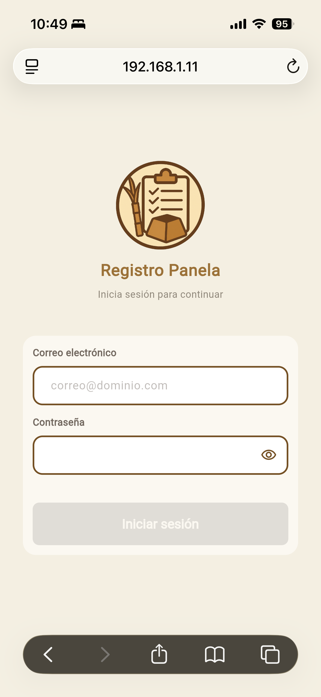</a> |
| **Selector de proyectos** — listado de lotes/proyectos en curso. | <a href="assets/images/Selector_de_proyectos.PNG">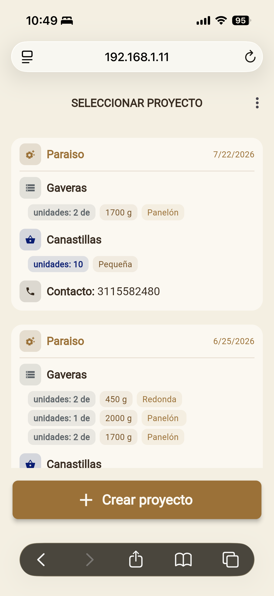</a> |
| **Stage 1 — Entrega** — formulario de gaveras, canastillas, preservativos y cal; selección de molienda. | <a href="assets/images/Stage_1_Entrega.PNG">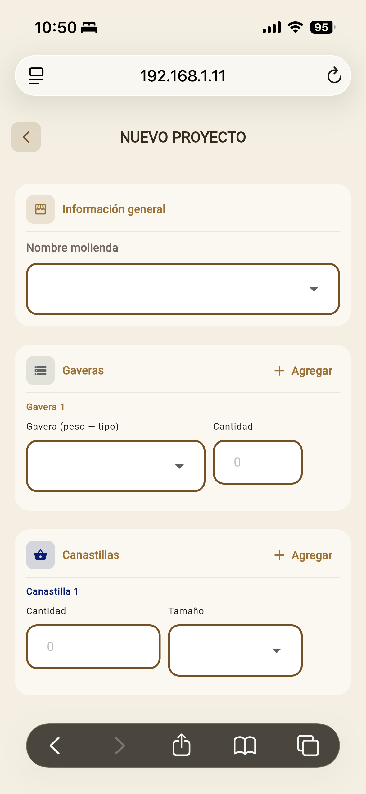</a> |
| **Stage 2 — Cargue** — registro del cargue de canastillas. | <a href="assets/images/Stage_2_Cargue.PNG">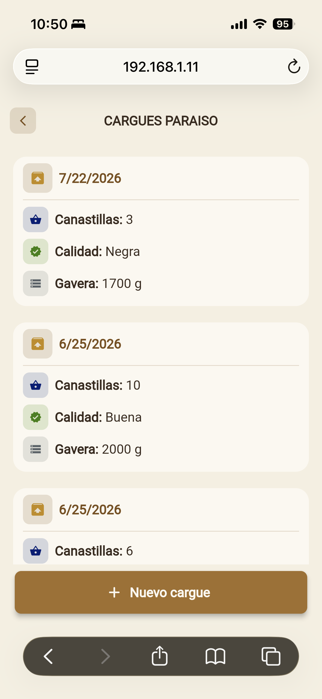</a> |
| **Stage 3 — Pesaje** — pesaje individual por canastilla con foto. | <a href="assets/images/Stage_3_Pesaje.PNG">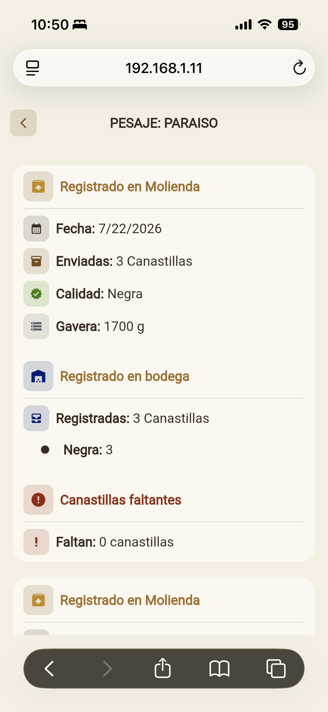</a> |
| **Stage 4 — Recolección** — devolución de gaveras/canastillas y preservativos. | <a href="assets/images/Stage_4_Recoleccion.PNG">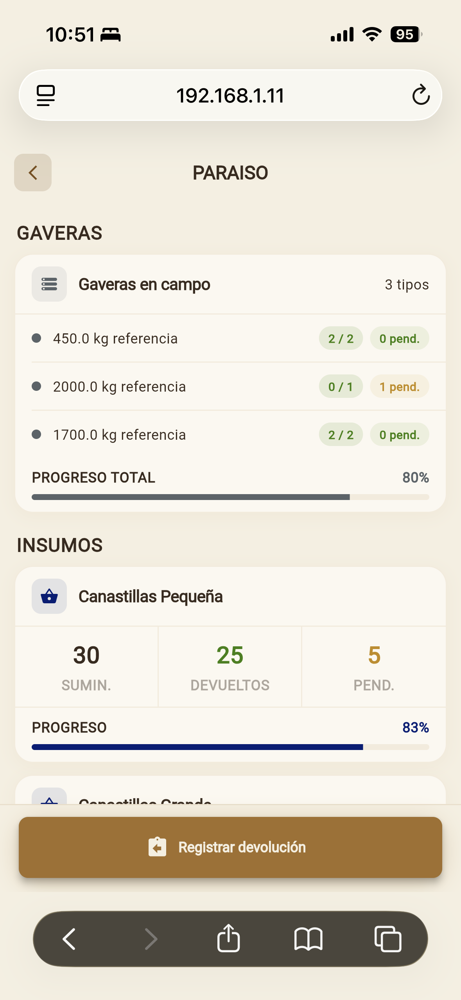</a> |
| **Stage 5 — Liquidación** — registros, resumen y factura final. | <a href="assets/images/Stage_5_cargues.PNG">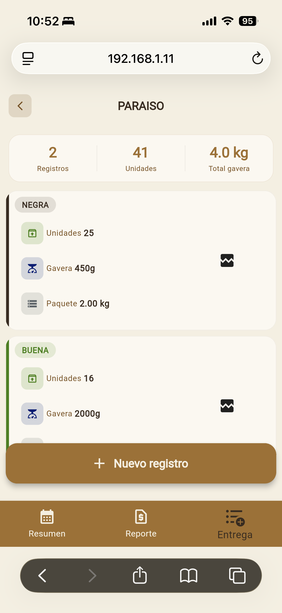</a> <a href="assets/images/Stage_5_resumen.PNG">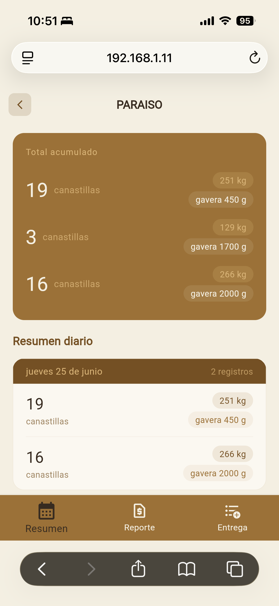</a> <a href="assets/images/Stage_5_Liquidacion.PNG">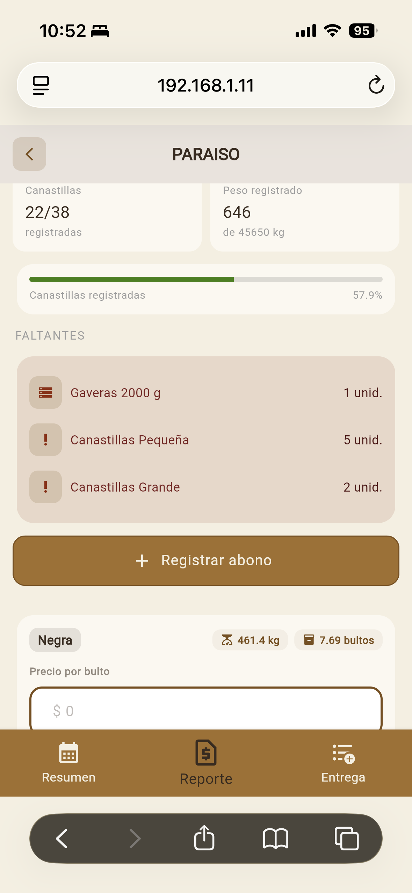</a> |
| **Inventario** — disponibilidad de gaveras y canastillas. | <a href="assets/images/Inventario.PNG">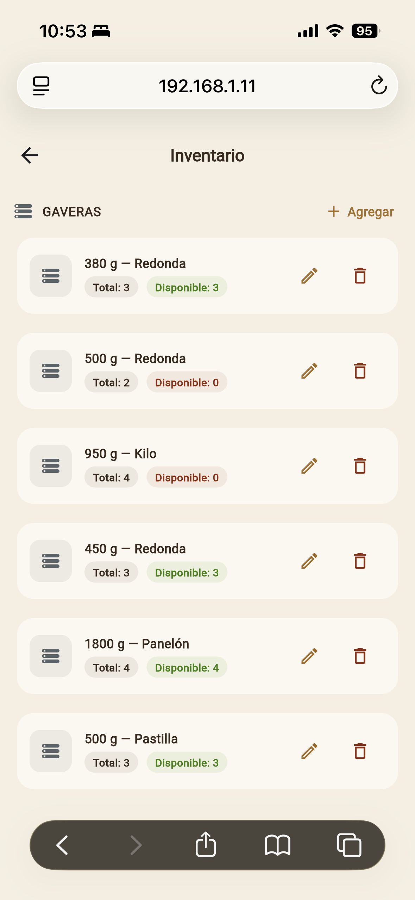</a> |
| **Moliendas** — catálogo de moliendas, entregas y su QR de trazabilidad. | <a href="assets/images/Moliendas.PNG">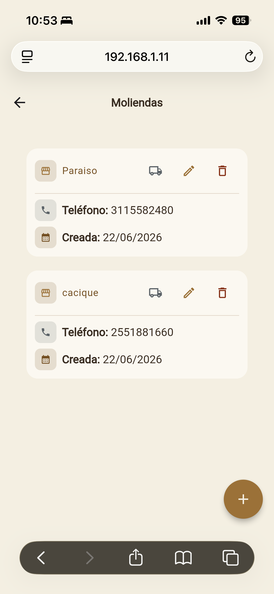</a> |
| **Administración** — gestión de usuarios y roles (solo `admin`). | <a href="assets/images/Administracion.PNG">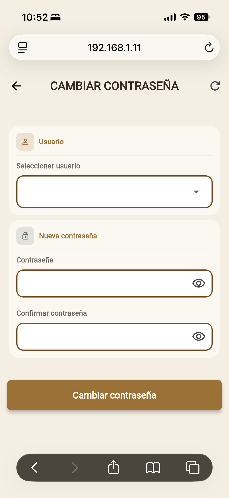</a> |
